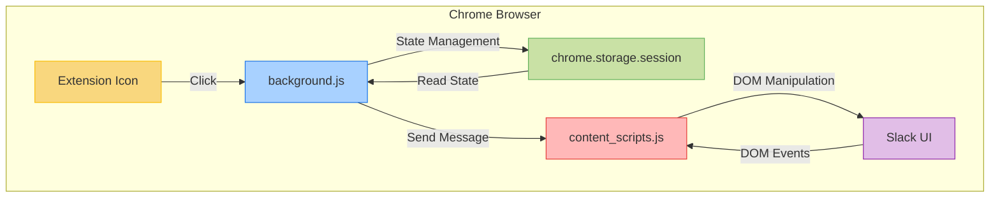
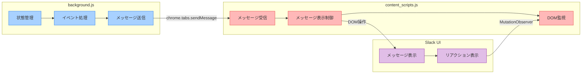
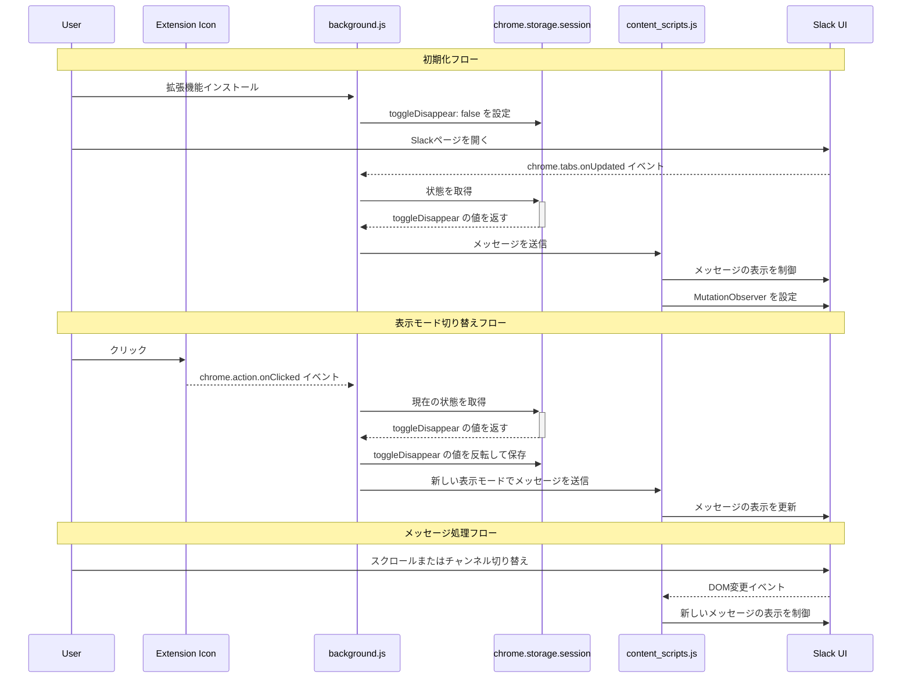
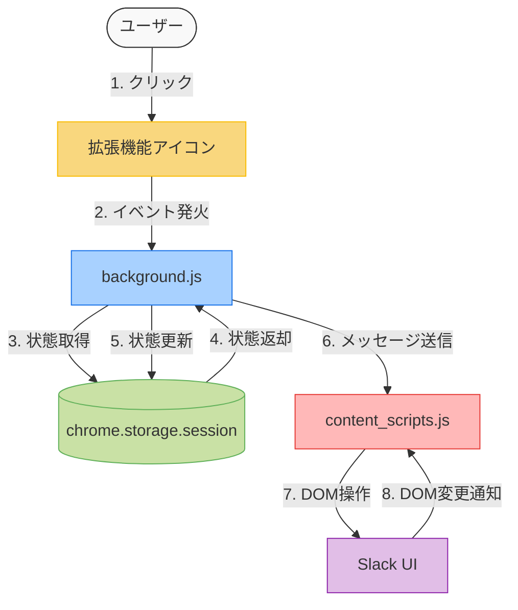

# 技術的詳細

このページでは、Chrome拡張機能「Slack メッセージ非表示」の技術的な詳細について説明します。

## アーキテクチャ

この拡張機能は、Chrome拡張機能のManifest V3に準拠しており、以下のコンポーネントで構成されています：

1. **Manifest** (`manifest.json`): 拡張機能の設定と権限を定義
2. **バックグラウンドスクリプト** (`background.js`): 拡張機能の状態管理とイベント処理
3. **コンテンツスクリプト** (`content_scripts.js`): Slack UIのDOM操作
4. **アイコン** (`images/`): 拡張機能のアイコン画像

### コンポーネント間の関係



### コンポーネントの役割



## ファイル構造

```
chrome_ext_disappear_slack_messages/
├── .gitignore
├── LICENSE
├── README.md
├── background.js
├── content_scripts.js
├── images/
│   ├── shikakukei-16.png
│   ├── shikakukei-32.png
│   ├── shikakukei-48.png
│   └── shikakukei-128.png
└── manifest.json
```

## 主要コンポーネントの詳細

### manifest.json

```json
{
  "manifest_version": 3,
  "name": "Slack メッセージ非表示",
  "version": "1.0.0",
  "author": "se.ishiguro.tomohiro@gmail.com",
  "description": "Slack ch. で 'done' というリアクションがついたメッセージを非表示にする",
  "permissions": [ "storage" ],
  "host_permissions": [ "https://app.slack.com/client/*" ],
  "background": {
    "service_worker": "background.js",
    "persist": false
  },
  "content_scripts": [
    {
      "matches": [ "https://app.slack.com/client/*" ],
      "js": [ "content_scripts.js" ]
    }
  ],
  "action": {}
}
```

主な設定：
- Manifest V3を使用
- `storage` 権限を要求（拡張機能の状態保存用）
- `https://app.slack.com/client/*` のホスト権限を要求
- バックグラウンドスクリプトとコンテンツスクリプトを定義
- `action` オブジェクトを定義（拡張機能アイコンのクリックイベントをリッスン）

### background.js

バックグラウンドスクリプトは、以下の役割を担っています：

1. **拡張機能の状態管理**：
   - `chrome.storage.session` を使用して表示モード（通常/集中）の状態を管理
   - 初期状態は通常モード（`toggleDisappear: false`）

2. **イベントリスナー**：
   - `chrome.runtime.onInstalled`: 拡張機能インストール時に初期状態を設定
   - `chrome.tabs.onUpdated`: Slackページの読み込み完了時に処理を実行
   - `chrome.action.onClicked`: 拡張機能アイコンのクリック時に表示モードを切り替え

3. **コンテンツスクリプトとの通信**：
   - `chrome.tabs.sendMessage` を使用してコンテンツスクリプトにメッセージを送信
   - メッセージには処理ID（`PROCESS_ID_SWITCH_DISPLAY`）と表示モード（`isDisappear`）を含む

### content_scripts.js

コンテンツスクリプトは、以下の役割を担っています：

1. **対象絵文字の定義**：
   ```javascript
   const TARGET_EMOJIS = [
     ":done:",
     ":done_1:",
     ":done-1:",
     ":done_ja:",
     ":done_en:",
   ];
   ```

2. **メッセージの表示制御**：
   - `constolMessagesWithDoneReaction` 関数でメッセージの表示/非表示を制御
   - 通常モード（`isDisappear: false`）: 対象メッセージを半透明（30%の不透明度）で表示
   - 集中モード（`isDisappear: true`）: 対象メッセージを完全に非表示

3. **DOM監視**：
   - `MutationObserver` を使用してSlackチャンネルのスクロールに対応
   - DOMの変更を検知すると、メッセージの表示制御処理を再実行

4. **メッセージ受信**：
   - `chrome.runtime.onMessage` でバックグラウンドスクリプトからのメッセージを受信
   - メッセージに含まれる表示モードに応じて処理を実行

## 処理フロー

1. **初期化**：
   - 拡張機能インストール時に初期状態（通常モード）を設定
   - Slackページ読み込み時に現在の表示モードを適用

2. **表示モード切り替え**：
   - 拡張機能アイコンのクリック時に表示モードを切り替え
   - バックグラウンドスクリプトが新しい状態をセッションストレージに保存
   - コンテンツスクリプトに新しい表示モードを通知

3. **メッセージ処理**：
   - コンテンツスクリプトがSlack UIのDOMを操作
   - 対象の絵文字リアクションを検出し、メッセージの表示スタイルを変更
   - DOMの変更を監視し、新しく表示されるメッセージにも処理を適用

### 実行フロー図



### データフロー図



## 拡張方法

### 対象絵文字の追加

新しい絵文字を対象に追加する場合は、`content_scripts.js`の`TARGET_EMOJIS`配列に追加します：

```javascript
const TARGET_EMOJIS = [
  ":done:",
  ":done_1:",
  ":done-1:",
  ":done_ja:",
  ":done_en:",
  // 新しい絵文字をここに追加
  ":new_emoji:",
];
```

### 表示スタイルの変更

表示スタイルを変更する場合は、`content_scripts.js`の透過率定数を変更します：

```javascript
const TRANSPARENCY_VISIBLE = 1; // 透過率  0%
const TRANSPARENCY_MIDDLE = 0.3; // 透過率 70%
// 新しい透過率を追加または既存の値を変更
```

## パフォーマンスに関する考慮事項

- DOM操作は比較的コストの高い処理であるため、大量のメッセージがある場合はパフォーマンスに影響する可能性があります
- `MutationObserver` はDOMの変更を監視するため、Slackの頻繁な更新がある場合は処理が多く実行される可能性があります
- 現在の実装では、すべてのメッセージを走査して対象の絵文字リアクションを検出しているため、最適化の余地があります
